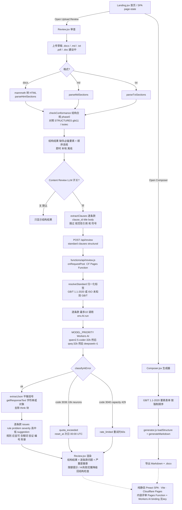

# Standards Tool (vstd) · 标准工具

**GB/T 1.1-2020 标准文本起草助手 — 结构脚手架 + LLM 逐条款内容评审**
**GB/T 1.1-2020 standard-drafting assistant — structural scaffold + LLM per-clause content review**

> 在线 / Live: **https://stdtool.pages.dev/**
> 完整目标(三大支柱)见 / Full north-star (3 pillars): [`GOAL.md`](./GOAL.md)

---

## 它能做什么 / What it does

**中文**
纯静态 Web 应用,帮助起草符合 GB/T 1.1-2020 的标准文本,包含两层评审:

1. **结构合规检查(Structural / phase 0)** — 按 GB/T 1.1-2020 第 8 章规定的要素顺序,检查封面、前言、范围、规范性引用、术语、技术要素、附录等是否齐全、是否按强制顺序排列。即时、本地、无需联网。
2. **LLM 逐条款内容评审(Content review,可选)** — 默认关闭的开关;打开后将每个条款送交大模型,按 GB/T 1.1-2020 + ISO/IEC Directives Part 2 起草规则挑出实质问题(应/宜/可误用、含糊词、规范性引用双向核对、技术要求缺试验方法、术语未定义/未使用等),给出**问题点 + 严重度(高/中/低)+ 改法**。AI 失效时优雅降级回结构检查。

并能将合规的标准骨架导出为 Markdown 与 .docx。

**English**
A pure-static web app for drafting GB/T 1.1-2020-compliant standards, with two review layers:

1. **Structural conformance (phase 0)** — checks element presence + the mandated order per GB/T 1.1-2020 Clause 8 (cover, foreword, scope, normative references, terms, technical elements, annexes…). Instant, local, offline.
2. **LLM per-clause content review (optional, default-off toggle)** — sends each clause to an LLM that flags substantive drafting-rule violations per GB/T 1.1-2020 + ISO/IEC Directives Part 2 (modal-verb 应/宜/可 misuse, vague language, bidirectional normative-reference citation, requirements lacking a test method, undefined/unused terms…), returning **issue + severity (高/中/低) + suggestion**. Gracefully degrades to structural-only if the AI call fails.

Compliant skeletons export to Markdown and .docx.

---

## 架构 / Architecture

**中文** — 纯静态 Preact SPA,Vite 构建,部署在 Cloudflare Pages;内容评审通过 Cloudflare Pages Function + Workers AI 绑定运行(**无需 API key**,模型跑在 CF 上)。

**English** — Pure-static Preact SPA, built with Vite, deployed on Cloudflare Pages. Content review runs through a Cloudflare Pages Function with the Workers AI binding (**no API key** — the model runs on Cloudflare).

```
vstd/
├── src/
│   ├── App.jsx              主应用 / app shell
│   ├── pages/Review.jsx     评审页:结构检查 + 内容评审开关 / review page: structural + content-review toggle
│   ├── conformance.js       结构合规 + 条款提取 / structural conformance + clause extraction (phase 0)
│   ├── generator.js         Markdown + .docx 导出 / document export
│   └── main.jsx, styles.css
├── functions/
│   └── api/review.js        Pages Function:Workers AI 逐条款评审 / per-clause LLM review via env.AI
├── data/gbt11_structure.json   GB/T 1.1-2020 要素模板 / element template
├── reference/GBT_1.1-2020.pdf  源标准 / source standard
├── sample_output/              样例输出 / sample generated draft
├── wrangler.toml               CF Pages 配置(AI 绑定 + pages_build_output_dir="dist")
├── vite.config.js · package.json · index.html
└── dist/                       构建产物 / build output (deployed)
```

> **遗留 / Legacy:** `app.py` · `generator.py` · `requirements.txt` · `stlite-dist/` 是早期 Streamlit MVP,**已被上面的 Preact SPA 取代**,仅作历史保留。
> `app.py` / `generator.py` / `requirements.txt` / `stlite-dist/` are the original Streamlit MVP, **superseded by the Preact SPA above** — kept for history only.

---

## 流程图 / Flow

> 评审 + 生成两条主路。源:[`vstd_flow.mmd`](./vstd_flow.mmd)（Mermaid,可直接改）。
> Review + Composer pipelines. Source: [`vstd_flow.mmd`](./vstd_flow.mmd).



---

## 本地开发 / Local development

```bash
cd ~/work/obsidian/Visionox/StandardsTool
npm install
npm run dev        # Vite 开发服务器 / dev server
npm run build      # 产出 dist/ / production build
npm run preview    # 本地预览构建产物 / preview the build
```

**内容评审本地调试 / Content review locally** — 需要 Workers AI 绑定,用 `wrangler pages dev dist` 才能命中 `functions/api/review.js`;`npm run dev` 下内容评审会优雅降级(仅结构检查)。
The `AI` binding is only available under `wrangler pages dev dist`; under plain `npm run dev` content review degrades to structural-only.

### 内容评审模型 / Content-review model
- 主模型 / primary: `@cf/qwen/qwen2.5-coder-32b-instruct`(非推理、更省 Workers AI neuron / non-reasoning, lower neuron cost)
- 降级 / fallbacks: `@cf/qwen/qwq-32b` → `@cf/deepseek-ai/deepseek-r1-distill-qwen-32b`
- 限额提醒 / quota: Workers AI 免费额度 **10,000 Neurons/天(UTC 00:00 重置)**;大量评审建议开 Workers Paid 按量。Free tier is 10k Neurons/day; enable Workers Paid for heavy use.

---

## GB/T 1.1-2020 要素顺序 / Element order

按 GB/T 1.1-2020 第 8 章(各类要素的表述) / Per Clause 8 of GB/T 1.1-2020:

| 顺序 Order | 要素 Element | 必备? Required | 章条 Clause |
|-----------|-------------|----------------|------------|
| 1 | 封面 Cover | 必备 Required | - |
| 2 | 目次 Table of Contents | 可选 Optional | - |
| 3 | 前言 Foreword | 必备 Required | - |
| 4 | 引言 Introduction | 可选 Optional | - |
| 5 | 范围 Scope | 必备 Required | Clause 1 |
| 6 | 规范性引用文件 Normative References | 条件性 Conditional | Clause 2 |
| 7 | 术语和定义 Terms and Definitions | 条件性 Conditional | Clause 3 |
| 8 | 符号和缩略语 Symbols and Abbreviations | 可选 Optional | Clause 4+ |
| 9 | 技术要素 Technical Clauses | 必备 Required | Clause 4/5+ |
| 10 | 规范性附录 Normative Annexes | 可选 Optional | Annex A, B… |
| 11 | 资料性附录 Informative Annexes | 可选 Optional | Annex X, Y… |
| 12 | 参考文献 Bibliography | 可选 Optional | - |
| 13 | 索引 Index | 可选 Optional | - |

---

## 已知差距 / Known gaps

**中文**
- 封面未生成完整 GB/T 版式(ICS/CCS 条带、页眉图形)
- 术语条目不支持完整 GB/T 格式(优选术语、拒用术语、许用术语、符号)
- 技术条款编号在切换"符号"章时不自动调整
- 目次为占位符(未由标题自动生成)
- .docx 用普通段落样式(非 GB/T 版式:宋体正文、黑体标题、特定页边距)
- 生成前不校验必备要素是否非空
- 不支持多部分标准(GB/T XXXXX.N)
- 专利声明(附录 D 引用)仅占位
- 未建模 IEC 标准的勘误/修订结构

**English**
- Cover page does not generate the full GB/T layout (ICS/CCS band, header graphics)
- Term entries lack full GB/T format (preferred / deprecated / admitted term, symbol)
- Technical-clause numbering does not auto-adjust when the Symbols clause is toggled
- Table of contents is a placeholder (not auto-generated from headings)
- .docx uses plain paragraph styles (not GB/T typography: Song Ti body, Hei Ti headings, specific margins)
- No validation that required elements are non-empty before generating
- No multi-part standard support (GB/T XXXXX.N)
- Patent statement (Annex D) is a placeholder only
- IEC corrigendum / amendment structure not modeled

---

## 路线图 / Roadmap

当前工具是完整目标的一个切片(标准脚手架 + 内容评审)。完整三大支柱见 [`GOAL.md`](./GOAL.md):
This tool is a slice of the full goal (scaffold + content review). The three pillars are in [`GOAL.md`](./GOAL.md):
- **A** — 标准清单分类 + 按属地的数据收集 / standards-list classification + per-territory data collection
- **B** — 标准文本起草规则检查(本工具的内容评审层正是其起点)/ standard-text drafting-rule check (this tool's content-review layer is its first step)
- **C** — 见 GOAL.md / see GOAL.md
